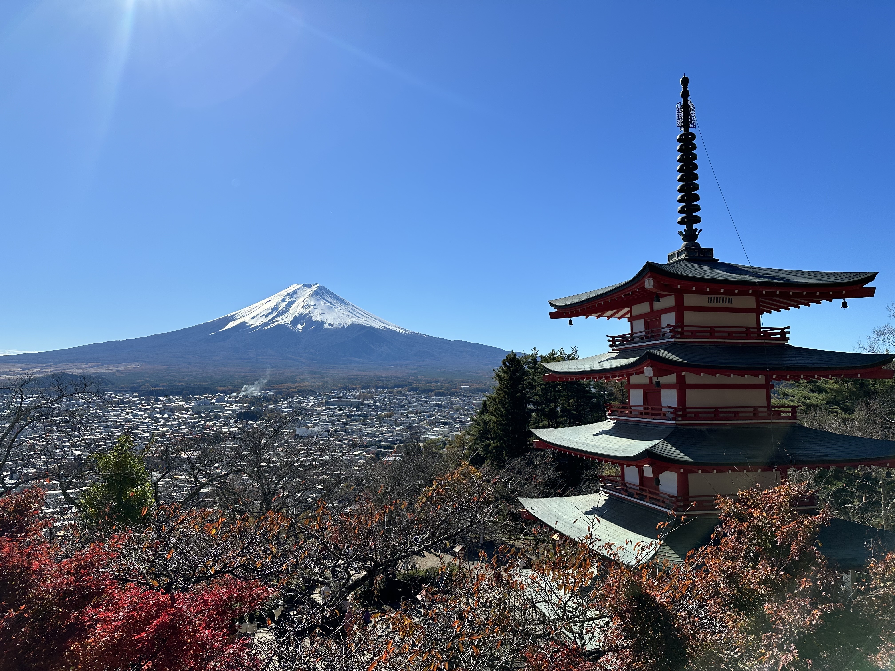

# [NeurIPS'24] Progressive Growing of Diffusion Autoencoder (PaGoDA)
<p align="center">

</p>

This repository houses the official PyTorch implementation of the paper titled [PaGoDA: Progressive Growing of a One-Step Generator from a Low-Resolution Diffusion Teacher](https://arxiv.org/abs/2405.14822) on ImageNet ranging from 64x64 to 512x512, which is presented at NeurIPS 2024. Our code is heavily based on [CTM](https://github.com/sony/ctm).


**Contacts**:
* Dongjun Kim: <a href="dongjun@stanford.edu">dongjun@stanford.edu</a>
* Chieh-Hsin (Jesse) Lai: <a href="chieh-hsin.lai@sony.com">chieh-hsin.lai@sony.com</a>

## TL;DR
We train one-step text-to-image generator that is progressively growing in its resolution. For that, we only need low-resolution diffusion models.

## Checkpoints and Datasets
- You may find PaGoDA's [checkpoints](https://drive.google.com/drive/folders/1tlm_DwPWcIIfF3s9qm_fHOeUjENTSOKx?usp=sharing) on ImageNet. It contains:
    - Stage 1's pretrained Diffusion Models at resolutions 32x32 and 64x64
    - Stage 2's PaGoDA's generator at resolutions 32x32 and 64x64
    - Stage 3's PaGoDA's generator (1) from resolution 64x64 → 128x128; (2) from resolution 64x64 → 256x256; (3) from resolution 64x64 → 512x512
- You may find the preprocessed data-to-noise datasets here (released soon) for training.

## Training
- For Stage2 distillation, run `bash commands/res64to64.sh`
- For Stage3 super-resolution, run from `bash commands/64to128.sh` to `bash commands/64to512.sh` sequentially. 

## Sampling

Please see `commands/sampling.sh` for detailed sampling commands.

## Citations

```
@article{kim2024pagoda,
  title={PaGoDA: Progressive Growing of a One-Step Generator from a Low-Resolution Diffusion Teacher},
  author={Kim, Dongjun and Lai, Chieh-Hsin and Liao, Wei-Hsiang and Takida, Yuhta and Murata, Naoki and Uesaka, Toshimitsu and Mitsufuji, Yuki and Ermon, Stefano},
  journal={arXiv preprint arXiv:2405.14822},
  year={2024}}
```
